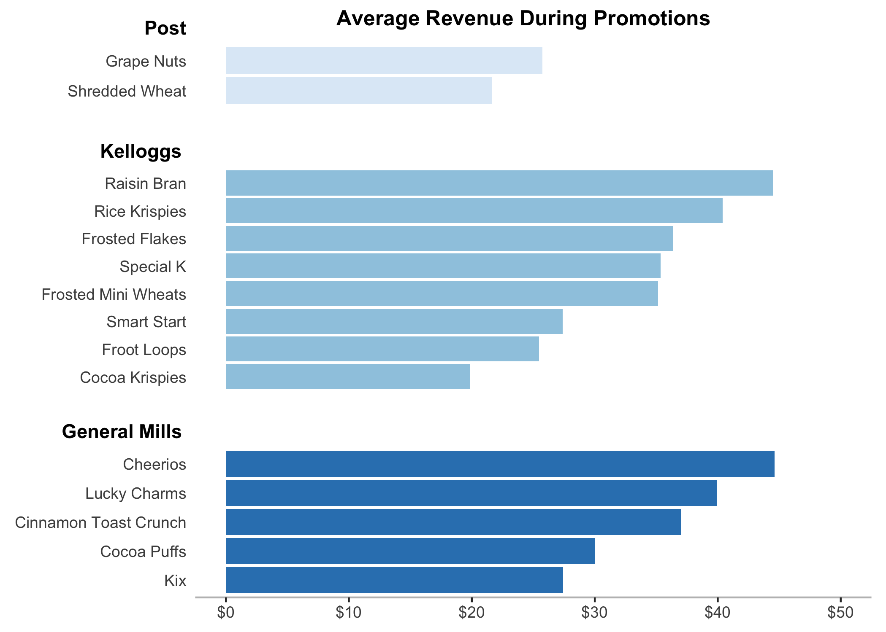

#### **To: General Mills Management**  
  
#### **From: Mark Russeff & Loi Pham**  
  
#### **Date: `r format(Sys.time(), '%B %d, %Y')`**   
  
#### **RE: General Mills Sales Analysis**  

*** 
  
```{r echo = FALSE}
# Course: BUAN 5210
# Title: Memo for General Mills
# Purpose: Provide Recommendations Based on our EDA
# Date: February 18, 2019
# Author: Mark Russeff & Loi Pham
```

  The General Mills family of branded cereals represent some of the most well-known and best-selling cereal brands in the world. Our team has been tasked with analyzing General Mills’ current advertising and promotional strategies and make recommendations that will grow market share and increase profitability moving forward. The sample data set used for our analysis was provided by General Mills and contains one year of sales, ad, and promotional data for various cereal brands. Our analysis revealed that while Kellogg’s may be the market leader in overall sales, General Mills is well positioned in the marketplace with considerable pricing power and strong revenue. Our team found that General Mills’ in-store promotions reliably yield better revenue than that of their competitors and that the current advertising strategy consistently produces larger unit sales but fails to significantly increase revenue. It is based on these findings that we have prepared two recommendations in order to optimize these strategies moving forward: First, we identified the Kix cereal brand as lagging behind its peers and as such we recommend lowering its price to increase units sold and drive revenue. Next, we recommend maintaining the current ad strategy but with an increase in the number of ads run without promotions in order to maximize units sold at higher price points, increasing revenue and improving return on investment for advertising.
  
  The focus of this analysis is to evaluate the current promotions and advertising strategies implemented by General Mills. It has been shown that the current promotional strategy has been successful at generating revenue. In the graph below, we can see that during promotions the average revenue of General Mills’ brands are strong. However, we can also see that Cocoa Puffs and Kix seem to be struggling to achieve similar revenues to their peers.    If we examine the second graph below containing just General Mills brands, we can see that while both Kix and Cocoa Puffs are falling short in terms of revenue, promotions for Cocoa Puffs have been very effective. There is no discernable change in Kix when a promotion is implemented. This could be due to the fact that Kix has a very high average price per volume so their packaging may be too small and customers are not seeing it as a "good value" whether it is on promotion or not.  Based on our analysis, our recommendation is to lower the price more on Kix during the in-store promotions and run specials on larger packaging sizes. By lowering the price and testing different packaging sizes during in-store promotions, new sales data can be gathered for further analysis that could yield revenue growth for Kix moving forward.     
  
<br> 
<br> 
{width=600px} 
<br>  
<br> 
<br> 
   
{width=600px}  

<br>   
<br>   
  In our analysis of the current advertising strategy we found that running ads of any size did not have a consistent effect on revenue. It did find that there is a reliable effect on the number of units sold. As you can observe in the graph below, in all cases the use of advertising increased the average units sold. This is a positive finding for General Mills. It demonstrates that the ads are effective but are just not translating to significant revenue increases. Our recommendation is to shift more of the advertising spending toward products that are not on promotion. Using ad buys for products that are at full price will help drive up revenue. In Addition, further analysis should be conducted to determine what other effects the increased unit sales may have on the brand that are more difficult to measure; like brand loyalty. It could be determined that increasing revenue is not required as long as the increase in units corresponds to other more intangible benefits. 
  
<br> 
<br> 
{width=600px}

<br> 
<br> 
  In conclusion, General Mills is currently positioned well in the marketplace and large overhauls to the promotional and advertising strategies are not required at this time. It should be noted, however, that while our small adjustments should yield results, further data analysis will be necessary to continue to address both the lagging revenue at Kix and the lack of revenue generated by the current advertising campaigns.

  Please do not hesitate to contact us if you have questions or would like to discuss the analysis further. We can also provide our complete analysis with data, code and additional graphs and tables if you would like more details. We look forward to working with you in the future as you continue to optimize and reevaluate your sales and marketing strategies.  
  
<br> 
<br> 
Sincerely,

Mark Russeff & Loi Pham

<br> 
<br> 
